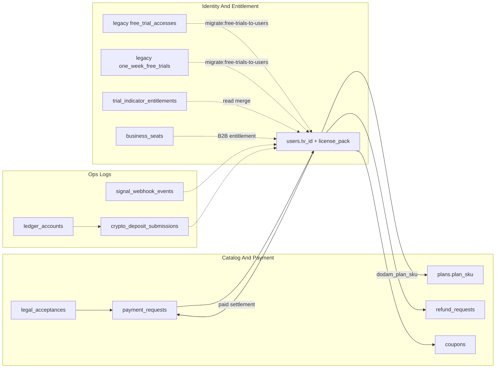

# Gemini용 · Magic Indicator API MongoDB 구조 브리핑

> 용도: Gemini 등 외부 LLM에 백엔드 DB 구조와 결제·권한 관계를 빠르게 설명할 때 사용하는 요약입니다.  
> 이 파일은 `magic-indicator-site/docs/` 안의 공유용 문서이며, 실제 API 정본은 백엔드 코드의 `server.js`, `src/db.js`, `src/schema-notes.js`, `src/entitlement-routes.js`를 우선합니다.

---

## 1. 운영 전제

| 항목 | 내용 |
|------|------|
| DB | MongoDB |
| 드라이버 | Node 공식 `mongodb` 드라이버, Mongoose 없음 |
| DB 이름 | `MONGODB_DB`, 미설정 시 관례적으로 `magic_indicator` |
| 연결 문자열 | `MONGODB_URI` |
| 컬렉션 상수 | 백엔드 `src/db.js`의 `COL` |
| Git 기준 | 홈페이지 백업 Git 원본은 `magic-indicator-site` 하나입니다. API 폴더에서 Git 커밋/푸시하지 않습니다. |

MongoDB는 DB 레벨 FK가 없습니다. 모든 관계는 애플리케이션 코드가 문자열·ObjectId 필드로 유지합니다.
게시판처럼 부모·자식 관계가 있는 영역은 DB가 자동 cascade 하지 않으므로, 앱 레이어에서 `comments.deleteMany({ post_id })` 후 `posts.deleteOne` 같은 순서를 지켜 고아 데이터를 방지합니다.

---

## 2. 핵심 컬렉션 역할

| 컬렉션 | 역할 |
|--------|------|
| `users` | 회원 단일 원장, `tv_id`, `license_pack`, `status`, `expires_at`, `paypal_subscription_id`, `backendRegularPrepaidConfirmed` 정본 |
| `plans` | MagicTrading SKU 카탈로그, `plan_sku` 기준 |
| `payment_requests` | 결제 준비·추적 원장, PG 메타와 `legal_acceptance_id` 참조 |
| `legal_acceptances` | 약관 전자서명 스냅샷 |
| `free_trial_accesses` | 레거시 무료 원장. 런타임 신규 쓰기/조회 금지, `scripts/migrateFreeTrialsToUsers.mjs`로 `users` 이관 |
| `one_week_free_trials` | 레거시 무료 웹훅 미러. 런타임 신규 쓰기/조회 금지, `users` 이관 후 폐기 대상 |
| `trial_indicator_entitlements` | 레거시 지표 TTL, 신규 쓰기 금지·조회 병합용 |
| `refund_requests` | 정규·비즈 월 과금 환불 접수 |
| `coupons` | 쿠폰 발행·교환·폐기 |
| `business_orgs` / `business_seats` | B2B 조직과 좌석 |
| `posts` / `comments` | 게시판 글·댓글 |
| `signal_webhook_events` | TV·MT5 시그널 웹훅 수신 감사 로그 |
| `crypto_deposit_submissions` | 가상자산 입금 신고 |
| `ledger_accounts` / `ledger_portfolio_snapshots` | 관리자용 Ledger 주소 원장·포트폴리오 스냅샷 |
| `site_visitors` / `site_visit_days` | 익명 방문 집계 |
| `board_read_days` / `board_readers` | 게시판 조회 집계 |

### 2026-06-03 17:51 KST 단일 원장·Invite-only 결제/권한 최종 싱크

- 최종 라이선스 생애주기 정본은 `users` 단일 도큐먼트입니다. 필수 운영 필드는 `username`, `tv_id`, `license_pack`, `status`, `expires_at`, `paypal_subscription_id`, `backendRegularPrepaidConfirmed`입니다.
- PayPal 0원 구독 생성(`BILLING.SUBSCRIPTION.CREATED` 또는 `subscription.created`)은 `applyFreeTrialSignup`으로 들어와 `users`에 무료 플랜 원장을 upsert하고, 즉시 TradingView Invite-only 5종 Add User API를 호출합니다.
- 무료 Pine 웹훅 가드는 더 이상 `free_trial_accesses`나 `one_week_free_trials`에 신규 원장을 만들지 않습니다. `users`에 활성 `tv_id + license_pack + expires_at`가 없으면 403으로 차단합니다.
- MagicTrading 3종 Pine은 `tg_id`를 웹훅에 포함할 수 있습니다. `POST /api/signals/webhook`은 `checkTrialWebhookEntitlement(db)` 및 Redis 5초 디바운싱 통과 직후 `relayTelegramSignal` 미들웨어를 실행해 BUY/SELL/EXIT/STOP 신호를 Telegram Bot API Markdown 메시지로 릴레이합니다.
- `tg_id`가 비어 있거나 숫자가 아니거나 `TELEGRAM_BOT_TOKEN`/`DODAM_TELEGRAM_BOT_TOKEN`이 없으면 텔레그램 발송만 skip하고, `users.status`, `users.expires_at`, 브로커/MT5 후속 웹훅 흐름은 계속 진행합니다.
- 정회원 1달 이벤트 사용자가 정규 상위 플랜 `Dodam_MagicTrading_MultiChart_Fixed`를 선결제하면 `ALREADY_ACTIVE_PLAN` 차단 예외로 처리합니다.
- 선결제 성공 시 `users.expires_at`는 `기존 이벤트 expires_at + 30일 + 보너스 1일`로 가산합니다.
- 동시에 `users.backendRegularPrepaidConfirmed = true`, `users.backend_regular_prepaid_confirmed = true`를 기록해 Pine의 선결제 완료 UI와 운영툴이 같은 상태를 읽을 수 있게 합니다.
- 기존 `users.paypal_subscription_id`가 있으면 PayPal Subscriptions cancel API를 호출하고, 결과를 `paypal_cancel_result`, `paypal_billing_status`로 남깁니다.
- 선결제 완료 알림은 문자/카카오 웹훅, 이메일 웹훅, SMTP, MT5 푸시를 함께 사용합니다.

---

## 3. 결제·약관 무결성 기준

결제 요청 생성 전 서버 가드가 정본입니다. 프런트엔드 값은 신뢰하지 않습니다.

### 필수 가드

- `legal_acceptance_id`는 필수입니다. 빈 값·잘못된 ObjectId·폐기된 약관 기록은 거부합니다.
- `legal_acceptances.terms_scope`는 선택 플랜의 scope와 일치해야 합니다.
- 지원하지 않는 플랜 코드(`acceptancePlanScope(planCode) === "unknown"`)는 결제 요청을 만들 수 없습니다.
- `plans` 카탈로그 문서가 있으면 장기 SKU 정책을 검사합니다.
  - `billing_cycle_months`, `billing_months`, `term_months`, `prepaid_months`, `duration_months`가 1개월 초과면 거부
  - `is_annual_membership`, `annual`, `billing_interval: year|annual`, `plan_kind`의 annual 계열은 거부
  - 다월 선납형은 거부

### 정책 문구

회사 정책상 연회원·다월 선납형 SKU는 생성하지 않습니다. 단, 1개월 이벤트 플랜의 잔여일 보호 목적의 정규 플랜 선결제는 예외이며, 새 SKU가 아니라 기존 이벤트 잔여일에 정규 플랜 30일과 보너스 1일을 가산하는 원장 연장 처리입니다.

---

## 4. 권한 판별 구조

MagicTrading 권한 검증의 정본은 `users` 단일 원장입니다.

| 소스 | 사용 이유 |
|------|-----------|
| `users` | 준회원 무료 체험, 1달 이벤트, 정규 다중차트, 영구제공 플랜의 단일 정본 |
| `free_trial_accesses` / `one_week_free_trials` | 과거 무료 체험 원장. 마이그레이션 입력으로만 사용 |
| `trial_indicator_entitlements` | 과거 레거시 TTL 호환 계층. 신규 무료/유료 판단 정본 아님 |
| `business_seats` | B2B 좌석 권한 확장 시 참조 |

`POST /api/signals/webhook` 앞단의 `checkTrialWebhookEntitlement`는 `license_pack`별로 `users`에서 `tv_id`, `status`, `expires_at`, `active_charts_limit`, `current_registered_tickers`, `permanent_access`를 확인합니다. 이 가드를 통과한 요청만 `relayTelegramSignal`로 넘어가므로 텔레그램 릴레이는 권한·만료 검증을 우회하지 않습니다.

무료 플랜도 PayPal 0원 결제 성공 후 `users`에 생성된 원장을 기준으로만 통과합니다. `users`에 없는 무료 Pine 웹훅은 자동 가입으로 처리하지 않고 차단합니다.

무인 3개월/1주 무료 코스 웹훅은 `POST /api/signals/webhook` 직전 `checkTrialWebhookEntitlement` 미들웨어에서 차단합니다. TradingView는 Pine 웹훅의 `"tv_id":"{{username}}"` 값을 `trv:<tv_id>`로 정규화합니다. 가드는 `users.license_pack`이 Pine의 `LICENSE_FIELD`와 일치하고 `users.status === "active"`이며 `users.expires_at`이 남아 있을 때만 통과시킵니다.

Pine의 차트 안내 메시지는 UI 표시입니다. MongoDB 권한 정본이 아니며, 실제 만료·중복 사용 차단은 서버의 `users` 문서와 `signal_webhook_events` 감사 로그가 기준입니다.

---

## 5. 논리 관계도

---

## 6. Gemini가 오해하면 안 되는 점

1. 컬렉션 이름이 비슷해도 MongoDB가 자동 JOIN/FK 검증을 하지 않습니다.
2. `payment_requests.legal_acceptance_id`는 선택 필드가 아니라 결제 요청 무결성의 필수 참조입니다.
3. `plans` 카탈로그가 있어도 프런트엔드 요청 SKU를 그대로 믿으면 안 됩니다.
4. 현재 운영 권한 정본은 `users`입니다. `free_trial_accesses`, `one_week_free_trials`는 이관용 레거시로만 설명해야 합니다.
5. 카드 PAN·민감 결제정보는 DB 저장 설계가 아닙니다. PG 참조와 상태 원장만 유지합니다.
6. Ledger 관련 컬렉션은 운영 원장·스냅샷 설명입니다. 고객에게 하드웨어 Ledger 자동 연동처럼 말하지 않습니다.
7. Pine 차트의 홈페이지/이벤트 안내는 UI 표시용입니다. 실제 무료/유료 만료일은 `users.expires_at` 기준으로 판단합니다.

---

## 7. 보류·운영 과제

- 레거시 무료 원장 이관: 운영 전 `npm run migrate:free-trials-to-users`를 1회 실행해 `free_trial_accesses`와 `one_week_free_trials`의 남은 데이터를 `users`로 병합합니다.
- `prepared`/웹훅 지연: 결제 요청 생성 후 PG 웹훅이 지연·탈락해 `prepared` 상태가 오래 남는 케이스에 대해 PG 책임 경계와 백오피스 알림 정책 확정 후 Dead Letter 또는 stale prepared 알림 설계
- `signal_webhook_events` TTL: 데이터 비대화를 막으려면 환경 변수 `SIGNAL_WEBHOOK_EVENTS_TTL_DAYS=90` 같은 양수를 설정해 TTL 인덱스를 운영
- 결제 가드 배포: API 프로세스 재기동 후 `npm run check`, `/api/payment/bank-approve`, `/api/payment/crypto-verify`, `/api/payments/prepare-checkout`, `/api/payments/paypal/create-order`의 활성 플랜 차단/선결제 예외 응답 확인
- 갱신 경고 크론: 운영 서버에서 `INSTALL_RENEWAL_WARNING_CRON=true`로 `deploy_backend.sh`를 실행하면 매일 09:00 `npm run warn:renewal`이 crontab에 설치됩니다.

---

## 8. 갱신 시점

- 기준 갱신: 2026-06-03 18:41 KST
- 이 문서는 API 데이터 구조, 결제 가드, 권한 판별, 운영 원장 정책이 바뀔 때 함께 갱신합니다.
