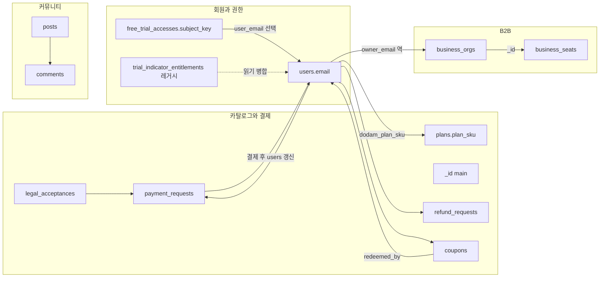

# Gemini용 · Magic Indicator API MongoDB 구조 브리핑

> **용도**: 제미나이 등 외부 LLM에게 “백엔드 DB에 무엇이 있고 무엇이 무엇을 가리키는가”만 빠르게 전달할 때 붙여 넣는 요약입니다.  
> **`GEMINI-HOMEPAGE-BRIEFING.md`와 같은 `docs/` 폴더**에서 홈 카피·Mongo를 한곳에서 집어넣기 위한 파일입니다.

**코드 정본**(상세 필드·API 흐름): 형제 디렉터리 `magic-indicator-api` 안의 **`src/schema-notes.js`** — 서버가 이 파일을 import해 스키마를 강제하지 않으며, OpenAPI 스펙도 아닙니다.

---

## 1. 기술 전제

| 항목 | 내용 |
|------|------|
| 드라이버 | **`mongodb` 공식 Node 드라이버** (`MongoClient`). **Mongoose 없음**. |
| DB 이름 | 환경 변수 `MONGODB_DB`(미설정 시 관례적으로 `magic_indicator`). 연결 문자열은 `MONGODB_URI`. |
| 컬렉션 상수 | **`magic-indicator-api/src/db.js`** 의 `COL` 객체 — 실제 문자열 이름과 1:1. |
| “테이블” | Mongo에서는 **컬렉션**이며, **DB 레벨 외래키(FK)·조인 제약 없음**. 관계는 **애플리케이션이 필드 값으로 유지**. |
| 인덱스 | `src/db-indexes.js` 의 `ensureAppIndexes` + `src/business-org-service.js` 의 비즈니스 조직 인덱스 등. |

---

## 2. 컬렉션 목록·역할(한 줄)

컬렉션 이름은 `COL` 과 동일 문자열입니다.

| 컬렉션 | 역할 요약 |
|--------|-----------|
| `users` | 회원 원장 — 이메일 키, Dodam 플랜(`dodam_plan_sku` 등), 지표 만료 TTL, OTP/TOTP 연동 필드, 쿠폰·문자패키지 등 |
| `plans` | MagicTrading SKU 카탈로그 (`plan_sku` 유니크) |
| `commercial` | 사이트 상업 번들 단일 문서 (`_id: "main"` 설계, 가격표·연동 플래그 등) |
| `payment_requests` | 결제 진행 전 준비·추적 — PG 메타와 `legal_acceptance_id` 참조 |
| `legal_acceptances` | 결제·체험 전 약관 수락 기록 |
| `refund_requests` | 정규·비즈 월 과금 일할 환불 접수 큐 |
| `coupons` | 쿠폰 발행·교환·폐기 |
| `counters` | 전역 일련번호(예: 쿠폰 코드용 `seq`) |
| `free_trial_accesses` | 7일 무상 등 **원장** — `subject_key` 글로벌 유니크(TRV·MT5 식별자 채널) |
| `trial_indicator_entitlements` | **레거시** 지표 TTL — 신규 쓰기 없음, 조회 시 `users` 와 오버레이 병합 |
| `business_orgs` | B2B 조직 한 건 — `owner_email` 로 대표 회원 연결 |
| `business_seats` | 조직 내 좌석 — `org_id` → `business_orgs._id` |
| `posts` / `comments` | 게시판 글·댓글 — `comments.post_id` ↔ `posts._id` |
| `tickets` | 지원 티켓 |
| `site_pages` | 내비·선택 커스텀 HTML |
| `referral_entries` | 추천인이 남긴 피추천인 1건 — `referrer_id` 보통 회원 이메일(X-User-Id) |
| `signal_webhook_events` | TV·MT5 시그널 웹훅 수신 감사 로그 |
| `crypto_deposit_submissions` | 가상자산 입금 신고 (`tracking_ref` 유니크) |
| `ledger_accounts` / `ledger_portfolio_snapshots` | 관리자용 Ledger 주소 원장·포트폴리오 스냅샷 — 스냅샷의 `account_id` 는 `ledger_accounts._id` 문자열 참조 패턴 |
| `phone_otp_codes` | SMS OTP 해시,TTL 만료 인덱스 |
| `pending_totp_enrollments` | Google OTP 등록 임시 세션,TTL |
| `site_visitors` / `site_visit_days` | 익명 방문 집계 |
| `board_read_days` / `board_readers` | 게시판 일일 조회 집계 |

---

## 3. 테이블(컬렉션) 간 연동 서머리

아래는 **실제 참조 패턴**(필드 기준 논리 링크)입니다.

### 3.1 회원·카탈로그·B2B

- **`users.email`** ← 중심 식별자(로그인 X-User-Id와 동일 취급되는 경로 많음).
- **`users.dodam_plan_sku`** ↔ **`plans.plan_sku`** — 상품 카탈로그 키 정합 (문자열 SKU).
- **`business_orgs.owner_email`** ↔ **`users.email`** — 조직 대표·결제 주체.
- **`business_seats.org_id`** → **`business_orgs._id`** (`ObjectId`).

### 3.2 결제·약관

- **`payment_requests.user_email`** ↔ **`users.email`**.
- **`payment_requests.legal_acceptance_id`** → **`legal_acceptances._id`** — 플랜 코드와 함께 `assertLegalAcceptance` 검증 후 저장 (`legal_terms_scope`, `legal_version` 스냅).
- PG(Airwallex 등) **`metadata.payment_request_id`** 가 **`payment_requests._id`** 문자열과 연결되어 웹훅에서 `paid`/`failed` 반영.

### 3.3 쿠폰·권한·체험

- **`coupons.redeemed_by`** ↔ 교환 회원 **`users.email`** — 일부 `coupon_kind` 는 `redeemed_by` 에 대한 **부분 유니크** 인덱스로 중복 교환 방지.
- **`free_trial_accesses.subject_key`** — `tradingview:…` / `mt5:…` 형태 **전역 유니크** 원장 키.
- **`free_trial_accesses.user_email`** — 회원 연동 시 사용자 이메일; 게스트 웹훅 경로는 `null` 가능.
- 활성 회원 무상 처리 시 **`indicator_on_user_doc: true`** 면 지표 TTL **정본은 `users`** 문서 — 원장과 이중 검증 패턴 설명은 `schema-notes.js` 참고.
- **`trial_indicator_entitlements`** — 과거 데이터 **읽기·병합만** (`entitlement` 검증 등).

### 3.4 환불·크립토

- **`refund_requests.user_email`** ↔ **`users.email`** — `plan_snapshot` 등 요청 시점 스냅.
- **`crypto_deposit_submissions.user_email`** — 신고자(공개 접수 포함).

### 3.5 커뮤니티·추천·운영 로그

- **`comments.post_id`** → **`posts._id`** — 글 삭제 시 고아 댓글 처리는 배치 또는 정책으로 앱이 담당(스키마에 FK 없음).
- **`referral_entries.referrer_id`** — 보통 피추천 폼 작성자 식별(이메일).
- **`signal_webhook_events`** — 회원 행 단독 참조 필드 고정 패턴보다 **파싱 JSON + users.telegram_chat_id / 이메일 라우팅** 규칙으로 연결.
- **`users.telegram_chat_id`** — 웹훅 라우팅용(별도 레거시 키 `telegram_chtaid` 보조 가능).

### 3.6 CMS·통계·내부

- **`site_pages.path`** 유니크 — 내비/주입 페이지.
- **`ledger_portfolio_snapshots.holdings[].account_id`** — 생성 시 **`ledger_accounts._id`** 를 문자열로 참조하는 패턴.
- **`counters._id`**(예: `coupon_global_seq`) + `seq` 필드로 쿠폰 번호 채번.

---

## 4. 관계도(개요)

복잡도가 높을 때 참고용 **논리 ERD**(Mongo FK 아님).

---

## 5. Gemini가 오해하면 안 되는 점

1. **컬렉션 이름만으로 JOIN이 자동 실행되지 않음** — API·집계 파이프라인에서 명시적으로 읽음.  
2. **`users` vs `free_trial_accesses` vs `trial_indicator_entitlements`** — 무상·지표 기간 판별은 **케이스별 정본 소스가 다름**; 상세 분기는 `schema-notes.js` 및 `POST /api/entitlement/magictrading/verify` 설명에 따름.  
3. **PCI·카드 PAN**은 DB 저장 설계 안 함 — PG 참조(`provider_ref` 등) 수준.  
4. 버전 업 시 이 문서가 구식일 수 있음 → **`magic-indicator-api`의 `src/db.js`(COL)·`schema-notes.js`·`server.js` 삽입 필드**를 우선 신뢰.

---

## 6. 근거 파일 (백엔드 패키지)

| 파일 | 내용 |
|------|------|
| `magic-indicator-api/src/db.js` | `COL`, 연결 헬퍼 |
| `magic-indicator-api/src/schema-notes.js` | 컬렉션·필드·인덱스·플로우 최장 메모 |
| `magic-indicator-api/src/db-indexes.js` | 기동 시 생성되는 인덱스 목록 |
| `magic-indicator-api/src/business-org-service.js` | 비즈니스 컬렉션 인덱스·좌석 생성 |

*이 문서 위치*: **`magic-indicator-site/docs/GEMINI-MONGODB-BRIEFING.md`** (제미나이 자료 허브). 참고용 원본 라우트였던 **`magic-indicator-api/docs/GEMINI-MONGODB-BRIEFING.md`** 는 위 경로로 안내합니다.

---

## 7. 제미나이 ERD 분석에 대한 검토 메모

- **`users.email` 중심** — 대체로 타당합니다. 추가로 무상 원장은 `free_trial_accesses.subject_key`(TRV/MT5 식별 채널), B2B는 `business_seats.org_id`(ObjectId)가 축입니다.
- **권한 이중화(users / free_trial_accesses)** — “유료만 users”가 아니라 `indicator_on_user_doc` 등에 따라 TTL 정본이 `users`로 옮겨지는 패턴이 있으므로, 제미나이 요약보다 세분 규칙은 `schema-notes.js`와 entitlement API 설명을 보는 편이 정확합니다.
- **`payment_requests` + `legal_acceptances`** — 결제 플로우 요약 타당합니다.
- **관리자 글 삭제 vs 고아 댓글** — 이미 **`comments.deleteMany({ post_id })` 후 `posts.deleteOne`** 순서(admin-routes)로 연쇄 삭제됩니다. 제안 ② 중 “글 삭제 시 댓글 정리”는 이 경로에선 구현되어 있습니다(다른 삭제 경로가 생기면 재검토).
- **`trial_indicator_entitlements` 마이그레이션(①)** — 운영·데이터 무결성 이슈이므로 별도 계획(백필 후 읽기 제거)으로 두는 편이 맞습니다. 자동 코드 변경으로 급하게 끊기 어렵습니다.
- **`prepared`/웹훅 지연(③)** — Dead Letter 또는 stale `prepared` 알림은 합리적 제안입니다. 상태 모델·과금 책임과 맞춰 설계해야 하며 미구현 상태에서 문서만으로는 픽스 불가입니다.
- **시그널 로그 TTL(④)** — **선택 가능한 TTL 인덱스**를 반영했습니다. `.env`에 `SIGNAL_WEBHOOK_EVENTS_TTL_DAYS=90` 과 같이 **양수**를 주면 `signal_webhook_events` 가 `received_at` 기준으로 자연 만료됩니다(법적 보존 필요 시 TTL 비활성화 또는 더 긴 기간 선택).

---

## 8. 보류된 과제 및 향후 권장 순서

시스템 안정성을 위해 아래 과제는 **단계적으로** 접근하는 것이 타당합니다.

1. **레거시 이관 (`trial_indicator_entitlements`)**  
   권한 판별 로직이 깨지지 않도록 **별도 마이그레이션·롤백 플랜**을 문서화한 뒤 **장기 과제**로 추진합니다. 백필 검증 후 읽기 병합 코드 제거 순서가 일반적입니다.

2. **결제 Pending / 상태 관리 고도화**  
   PG 규약·고객 워크플로를 먼저 확정하고, **백오피스 설계**와 병행해 상태 전이(`prepared`/웹훅 지연/Dead Letter 알림 등)를 시스템에 반영하는 편을 권장합니다.

---

## 9. 운영 적용 가이드(TTL 등)

1. **인덱스 반영**: 배포 후 **API 프로세스를 재기동**하여 `ensureAppIndexes`가 한 번 실행되도록 합니다 (`server.js` 기동 경로 기준).

2. **시그널 로그 TTL 활성화**: 로그 자동 삭제가 필요하면 환경 변수에 **`SIGNAL_WEBHOOK_EVENTS_TTL_DAYS=90`** 처럼 원하는 **보존 일수(양수)** 를 설정합니다. 미설정·0·비양수면 TTL 인덱스를 만들지 않습니다.

3. **TTL 일수 변경 시**: 동일 이름 인덱스(`signal_webhook_events_received_ttl`)가 이미 있으면 MongoDB에서 **인덱스 삭제 후** 원하는 값으로 재기동·재생성하거나, 배포 프로세스에 인덱스 마이그레이션 단계를 두는 편이 안전합니다. 상세는 `.env.example` 주석 참고.
