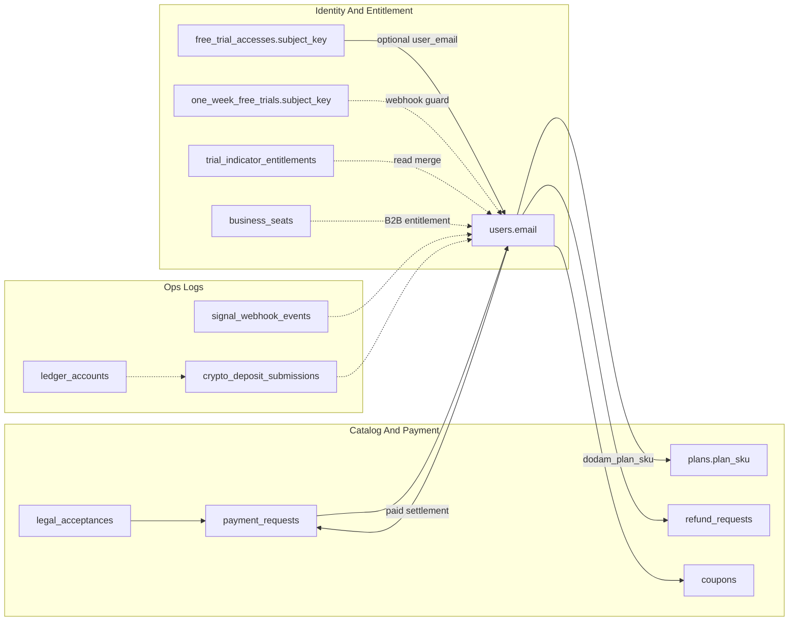

# Gemini용 · Magic Indicator API MongoDB 구조 브리핑

> 용도: Gemini 등 외부 LLM에 백엔드 DB 구조와 결제·권한 관계를 빠르게 설명할 때 사용하는 요약입니다.  
> 이 파일은 `magic-indicator-site/docs/` 안의 공유용 문서이며, 실제 API 정본은 백엔드 코드의 `server.js`, `src/db.js`, `src/schema-notes.js`, `src/entitlement-routes.js`를 우선합니다.

---

## 1. 운영 전제

| 항목 | 내용 |
|------|------|
| DB | MongoDB |
| 드라이버 | Node 공식 `mongodb` 드라이버, Mongoose 없음 |
| DB 이름 | `MONGODB_DB`, 미설정 시 관례적으로 `magic_indicator` |
| 연결 문자열 | `MONGODB_URI` |
| 컬렉션 상수 | 백엔드 `src/db.js`의 `COL` |
| Git 기준 | 홈페이지 백업 Git 원본은 `magic-indicator-site` 하나입니다. API 폴더에서 Git 커밋/푸시하지 않습니다. |

MongoDB는 DB 레벨 FK가 없습니다. 모든 관계는 애플리케이션 코드가 문자열·ObjectId 필드로 유지합니다.
게시판처럼 부모·자식 관계가 있는 영역은 DB가 자동 cascade 하지 않으므로, 앱 레이어에서 `comments.deleteMany({ post_id })` 후 `posts.deleteOne` 같은 순서를 지켜 고아 데이터를 방지합니다.

---

## 2. 핵심 컬렉션 역할

| 컬렉션 | 역할 |
|--------|------|
| `users` | 회원 원장, 이메일 중심 식별자, Dodam 플랜·지표 TTL·OTP·쿠폰·문자패키지 |
| `plans` | MagicTrading SKU 카탈로그, `plan_sku` 기준 |
| `payment_requests` | 결제 준비·추적 원장, PG 메타와 `legal_acceptance_id` 참조 |
| `legal_acceptances` | 약관 전자서명 스냅샷 |
| `free_trial_accesses` | 7일 체험 등 무상 원장, `subject_key` 글로벌 유니크 |
| `one_week_free_trials` | 무인 1주 무료 체험 웹훅 가드 원장, `trv_id`/`mt5_account`/`mt5_server`와 최초 유입 시각 관리 |
| `trial_indicator_entitlements` | 레거시 지표 TTL, 신규 쓰기 금지·조회 병합용 |
| `refund_requests` | 정규·비즈 월 과금 환불 접수 |
| `coupons` | 쿠폰 발행·교환·폐기 |
| `business_orgs` / `business_seats` | B2B 조직과 좌석 |
| `posts` / `comments` | 게시판 글·댓글 |
| `signal_webhook_events` | TV·MT5 시그널 웹훅 수신 감사 로그 |
| `crypto_deposit_submissions` | 가상자산 입금 신고 |
| `ledger_accounts` / `ledger_portfolio_snapshots` | 관리자용 Ledger 주소 원장·포트폴리오 스냅샷 |
| `site_visitors` / `site_visit_days` | 익명 방문 집계 |
| `board_read_days` / `board_readers` | 게시판 조회 집계 |

---

## 3. 결제·약관 무결성 기준

결제 요청 생성 전 서버 가드가 정본입니다. 프런트엔드 값은 신뢰하지 않습니다.

### 필수 가드

- `legal_acceptance_id`는 필수입니다. 빈 값·잘못된 ObjectId·폐기된 약관 기록은 거부합니다.
- `legal_acceptances.terms_scope`는 선택 플랜의 scope와 일치해야 합니다.
- 지원하지 않는 플랜 코드(`acceptancePlanScope(planCode) === "unknown"`)는 결제 요청을 만들 수 없습니다.
- `plans` 카탈로그 문서가 있으면 장기 SKU 정책을 검사합니다.
  - `billing_cycle_months`, `billing_months`, `term_months`, `prepaid_months`, `duration_months`가 1개월 초과면 거부
  - `is_annual_membership`, `annual`, `billing_interval: year|annual`, `plan_kind`의 annual 계열은 거부
  - 다월 선납형은 거부

### 정책 문구

회사 정책상 1개월 초과 장기 선결제, 연회원, 다월 선납형 상품은 `payment_requests` 생성 대상이 아닙니다.

---

## 4. 권한 판별 구조

MagicTrading 권한 검증은 한 컬렉션만 보지 않습니다.

| 소스 | 사용 이유 |
|------|-----------|
| `users` | 정회원·유료 플랜·지표 TTL 정본이 될 수 있음 |
| `free_trial_accesses` | TRV/MT5 식별자 기반 무상 체험 원장 |
| `one_week_free_trials` | 웹훅 최초 유입 기준 7일만 허용하는 무인 무료 체험 사용 이력 |
| `trial_indicator_entitlements` | 과거 레거시 TTL 호환 계층 |
| `business_seats` | B2B 좌석 권한 확장 시 참조 |

`POST /api/entitlement/magictrading/verify` 계열 로직은 이메일과 subject key를 함께 보며, 만료일·활성 상태를 병합해 최종 권한을 판단합니다.
`indicator_on_user_doc: true` 패턴에서는 지표 TTL 정본이 `users` 문서로 이동할 수 있으므로, 백오피스나 LLM이 `users` 단일 컬렉션 또는 체험 원장 단일 컬렉션만 보고 권한을 확정하면 안 됩니다.

`trial_indicator_entitlements`는 즉시 제거하면 안 됩니다. 백필, 샘플 검증, 롤백 플랜을 만든 뒤 읽기 병합 제거 순서로 이관합니다.

무인 1주 무료 체험 웹훅은 `one_week_free_trials.subject_key`를 기준으로 중복 사용을 막습니다. TradingView는 Pine 웹훅의 `"tv_id":"{{username}}"` 값을 `trv:<tv_id>`로 정규화하고, MT5는 `mt5:<server>:<account>` 형식으로 식별합니다. 최초 유입 시각에서 7일을 초과하면 403으로 차단하고 `signal_webhook_events`에 감사 로그를 남깁니다.

Pine의 `DMT_Free_1Week` 차트 안내 메시지는 `showTrialGuide`가 켜졌을 때 고정 안내 문구만 보여주는 UI 표시입니다. MongoDB 권한 정본이 아니며, 실제 만료·중복 사용 차단은 서버의 `one_week_free_trials` 문서와 감사 로그가 기준입니다.

---

## 5. 논리 관계도

---

## 6. Gemini가 오해하면 안 되는 점

1. 컬렉션 이름이 비슷해도 MongoDB가 자동 JOIN/FK 검증을 하지 않습니다.
2. `payment_requests.legal_acceptance_id`는 선택 필드가 아니라 결제 요청 무결성의 필수 참조입니다.
3. `plans` 카탈로그가 있어도 프런트엔드 요청 SKU를 그대로 믿으면 안 됩니다.
4. `users`, `free_trial_accesses`, `trial_indicator_entitlements` 중 하나만 보고 권한을 단정하면 안 됩니다.
5. 카드 PAN·민감 결제정보는 DB 저장 설계가 아닙니다. PG 참조와 상태 원장만 유지합니다.
6. Ledger 관련 컬렉션은 운영 원장·스냅샷 설명입니다. 고객에게 하드웨어 Ledger 자동 연동처럼 말하지 않습니다.
7. Pine 차트는 체험 일차를 계산하지 않습니다. 실제 1주 체험 만료일은 `one_week_free_trials.trial_started_at`과 `expires_at` 기준으로 판단합니다.

---

## 7. 보류·운영 과제

- `trial_indicator_entitlements` 이관: 백필 → 샘플 검증 → 롤백 계획 → 읽기 병합 제거 순서 권장
- `prepared`/웹훅 지연: 결제 요청 생성 후 PG 웹훅이 지연·탈락해 `prepared` 상태가 오래 남는 케이스에 대해 PG 책임 경계와 백오피스 알림 정책 확정 후 Dead Letter 또는 stale prepared 알림 설계
- `signal_webhook_events` TTL: 데이터 비대화를 막으려면 환경 변수 `SIGNAL_WEBHOOK_EVENTS_TTL_DAYS=90` 같은 양수를 설정해 TTL 인덱스를 운영
- 결제 가드 배포: API 프로세스 재기동 후 `node --check server.js` 및 실제 결제 준비 API 400 응답 케이스 확인

---

## 8. 갱신 시점

- 기준 갱신: 2026-06-02 22:34 KST
- 이 문서는 API 데이터 구조, 결제 가드, 권한 판별, 운영 원장 정책이 바뀔 때 함께 갱신합니다.
